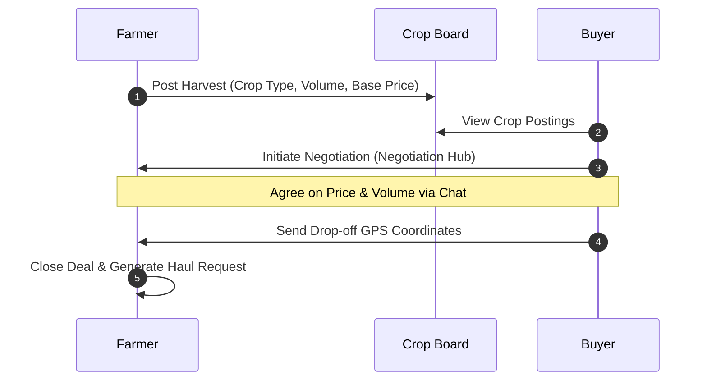
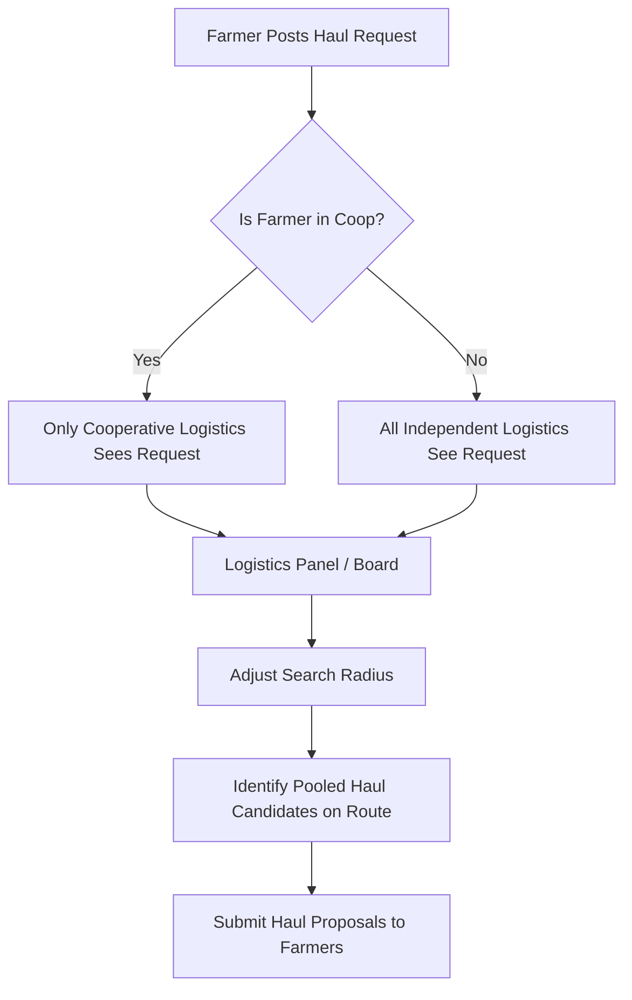
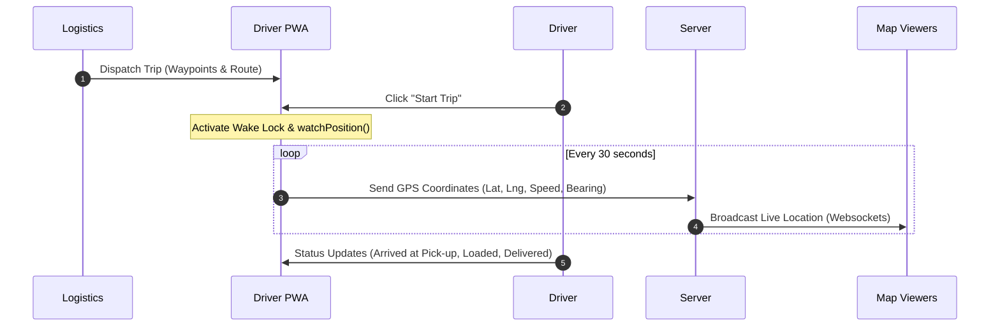

# HarvestHaul System Workflow & Implementation Plan

HarvestHaul is a B2B crop distribution and logistics management system designed to connect farmers, logistics companies, cooperatives, and buyers with real-time tracking and resource pooling.

---

## User Roles & Registration

### 1. Registration Options
- **Farmer**: Registers as either **Independent** or **Cooperative Member**. If cooperative, must select from a list of registered Cooperatives.
- **Logistics**: Registers as an **Independent Logistics Partner** (fleet owner).
- **Cooperative**: Registers as a unified entity. Combines buying power, logistics (own fleet/trucks), and crop selling.
- **3rd Party Buyer**: Registers as a commercial/business buyer.
- **Driver**: Registered and managed directly under a Logistics Partner or Cooperative. Receives credentials to log into the Driver PWA.
- **Admin**: Internal role. Not publicly registrable.

---

## Module 1: Crop Listing & B2B Negotiation

### Flow Detail
1. **Listing**: Farmer posts harvest availability (crop type, volume in kg/tons, base price, harvest date, pick-up address/coordinates).
   - If cooperative farmer: Posting is private, visible *only* to their Cooperative Buyer dashboard.
   - If independent farmer: Posting is public on the B2B Crop Board.
2. **Negotiation**: 3rd Party Buyer views listings, initiates a chat in the **Negotiation Hub**. They negotiate unit price and volume.
3. **Closing Deal**: Once agreed, the Buyer confirms the deal and shares their drop-off location coordinates. The deal status changes to `Pending Hauling`.
4. **Haul Request Generation**: Farmer inputs the buyer's drop-off coordinates, cargo weight/volume, and crop type to generate a new **Haul Request**.

---

## Module 2: Haul Request Board & Resource Pooling

### Flow Detail
1. **Visibility Rules**:
   - Independent Farmer Haul Request -> Visible on public **Haul Board** for all **Independent Logistics**.
   - Cooperative Farmer Haul Request -> Visible only to the **Cooperative Logistics** dispatch console.
2. **Resource Pooling & Radius Search**:
   - Logistics providers view the Haul Board.
   - They can adjust a **Search Radius (in kilometers)** around their truck's current location or target route.
   - If a truck has spare capacity (weight in kg and volume in cubic meters) and is executing Route A -> B, the system calculates and highlights other pending Haul Requests (Pick-ups and Drop-offs) within the search radius of the main route.
3. **Bidding / Pricing**:
   - The system calculates an estimated hauling price based on distance and baseline parameters.
   - Logistics can submit a proposal with the estimated price or input a custom bid to negotiate with the Farmer.
4. **Agreement**: Farmer reviews proposals in their **Proposal Inbox** and selects a Logistics provider. Deal status changes to `Assigned`.

---

## Module 3: Dispatch Console & Waypoint Routing

### Flow Detail
1. **Route Construction**:
   - Inside the **Dispatch Console**, the Logistics dispatcher selects an active vehicle and assigns one or more accepted Haul Requests to it.
   - The system displays a map with pins for all Pick-up points and Drop-off points for the grouped hauls.
2. **Waypoint Sequencing**:
   - The Dispatch Console calculates the most optimal sequence of stops (e.g., Pick-up 1 -> Pick-up 2 -> Drop-off 1 -> Drop-off 2) to minimize travel distance and respect truck capacity constraints.
3. **Driver Assignment**:
   - Dispatcher assigns the constructed route (sequence of waypoints) to a registered **Driver**.
   - The route and trip details are sent to the Driver's mobile device.

---

## Module 4: Driver PWA & Real-Time Tracking

### Technical Stack
- **Frontend**: PWA with Service Workers for offline caching and web app installability.
- **Tracking**: HTML5 Geolocation API (`navigator.geolocation.watchPosition`).
- **Persistence**: Wake Lock API to prevent the driver's device screen from sleeping, ensuring continuous geolocation telemetry back to the server.

### Trip Lifecycle & Status Updates
- **Assigned**: Trip sent to driver.
- **In Transit (Pick-up)**: Driver clicks "Start Trip". Live tracking begins.
- **Arrived at Pick-up**: Driver reaches farmer.
- **Loaded**: Cargo loaded. Driver inputs actual weight/volume loaded.
- **In Transit (Drop-off)**: Driver travels to buyer.
- **Delivered**: Driver clicks "Delivered" and uploads a photo of the physical delivery receipt/crops at the drop-off site.
- **Completed**: Buyer logs in and clicks "Confirm Receipt" (or Auto-completes after 48 hours).

### Multi-Tenant Live Map Tracking
During the trip, the following users see the live truck icon on their respective maps:
- **Logistics Dispatcher**: Can see all fleet vehicles active on the map.
- **Farmer**: Can track the assigned truck from trip start until crop pick-up.
- **Buyer**: Can track the assigned truck from pick-up until arrival at their drop-off coordinates.

---

## Module 5: Offline Payment Workflow

Since there is no online payment gateway integrated, the system manages payment status manually:
1. **Pricing Finalization**: The negotiated price (from crop negotiation) and hauling fee (from logistics negotiation) are locked into a **Cost Ledger**.
2. **Payment Status**: The Ledger shows items as `Unpaid`.
3. **Manual Settlement**:
   - Payments are completed cash-on-delivery (COD) or bank transfer.
   - The paying party uploads an image of the bank receipt or cash voucher to the system.
   - The receiving party marks the invoice as `Paid` in their dashboard, closing the transaction.

---

## Module 6: Analytics & Reports

### 1. Admin Platform Insights
- **Crop Pricing Trends**: Real-time average price per kg for each crop category based on completed transactions. Includes weekly price fluctuations.
- **Logistics Efficiency Dashboard**: Average fuel efficiency, delivery delay logs, average trip durations.
- **Baseline Price Management**:
  - Weekly scraper script gathers average market prices from Department of Agriculture data.
  - **Manual Admin Override**: Admin interface to edit and override baseline crop prices in the database when scraping fails.

### 2. Farmer Earnings & Insights
- **Net Profit Calculator**: Farmer inputs seed, fertilizer, labor, and hauling costs. System subtracts this from the crop sale price to show net profit margins.
- **Pricing Guidance**: Shows if their listed price is above, below, or equal to the current market trend.

### 3. Logistics / Cooperative Fleet Analytics
- **Fuel Tracking Ledger**: Drivers input fuel refill quantities and costs. System calculates average kilometers per liter (KPL) and total fuel spend.
- **Revenue per Vehicle**: Calculates earnings generated by each truck relative to fuel and driver costs.

---

## Database Schema Highlights

### `Users` Table
- `id` (PK)
- `name`, `email`, `password_hash`
- `role`: `FARMER`, `LOGISTICS`, `COOPERATIVE`, `BUYER`, `DRIVER`, `ADMIN`
- `cooperative_id` (FK to `Cooperatives` table, nullable)
- `verification_status`: `PENDING`, `APPROVED`, `REJECTED`

### `Crops` Table (Crop Registry)
- `id` (PK)
- `crop_name`, `category` (e.g., Grains, Vegetables, Fruits)
- `baseline_price_per_kg` (Updated by scraper or Admin)

### `HarvestListings` Table
- `id` (PK)
- `farmer_id` (FK to `Users`)
- `crop_id` (FK to `Crops`)
- `volume_kg`, `price_per_kg`
- `status`: `AVAILABLE`, `NEGOTIATING`, `SOLD`

### `HaulRequests` Table
- `id` (PK)
- `farmer_id` (FK to `Users`)
- `buyer_id` (FK to `Users`)
- `crop_listing_id` (FK to `HarvestListings`)
- `pickup_latitude`, `pickup_longitude`
- `dropoff_latitude`, `dropoff_longitude`
- `weight_kg`, `volume_cubic_meters`
- `status`: `PENDING_LOGISTICS`, `PROPOSAL_ACCEPTED`, `DISPATCHED`, `COMPLETED`

### `Trips` Table
- `id` (PK)
- `logistics_id` (FK to `Users` or `Cooperatives`)
- `driver_id` (FK to `Users`)
- `truck_id` (FK to `Trucks`)
- `waypoint_sequence` (JSON array of coordinates/stops)
- `current_latitude`, `current_longitude`
- `status`: `ASSIGNED`, `IN_TRANSIT_PICKUP`, `LOADED`, `IN_TRANSIT_DROPOFF`, `DELIVERED`, `COMPLETED`

---

## Verification Plan

### Automated Verification
- Verify visibility rules: Cooperative farmer listings do not leak to independent logistics.
- Verify radius query logic: Haul requests outside search radius are filtered out correctly.
- Verify Wake Lock API capability in driver simulation test.

### Manual Verification
- Driver PWA simulation: Emulate GPS changes via browser developer tools. Ensure real-time map marker updates for Logistics, Farmer, and Buyer dashboards.
- Receipt upload and manual override testing in Admin console.
